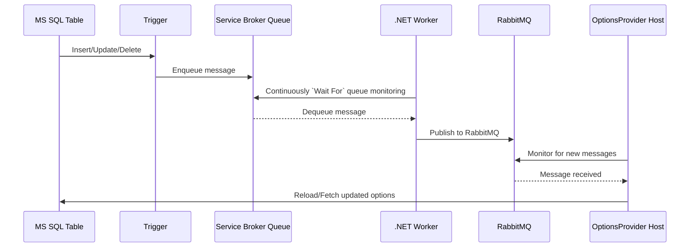

# Demo.DbValuesMonitoring

#### Aims
- explore `Aspire`
- explore `WolverineFX` nuget library
- demonstrate `OptionsProvider` that reads configuration values from database, and is able to monitor for change

> One of the clients I worked for had a scenario where configuration settings were stored in database.
Problem is reading configuration from database and reloading configuration values on change. 

## Startup
Assume Aspire will take care of everything. Start AppHost project. Docker on standard port is required. 
Solution will download 2 images, one for MS SQL server, second for RabbitMQ. First startup might take a moment.
Migration project is present, and will setup the database.

## Database value change monitoring

### Notification Service Worker
Background service is continously running and checking in MS SQL Service Broker Queue. Picked queue message is then 
published into RabbitMQ. For publishing `Wolverine` library is used.  
`Wolverine` is not able to monitor queue. For that reason simple `SqlCommand` is used. Command is run for 90s repeatedly.

### DbValueChangeMonitoring
Core of the monitoring is in `DbOptionsProvider.cs`. `Wolverine` is used, for this reason a separate 
host application is started. This application is continously monitoring RabbitMQ queue, 
and on signal received reloads options. 

### Wolverine
> I understand what is design aim of `Wolverine`, but personally I find it confusing. Internal workings, and how 
library is routing messages/jobs is not stated explicitly, so it is a magic. Takes some time to orient yourself.

RabbitMQ can be skipped, `Wolverine` can publish and listen on a port directly. Azure/AWS queues integration is also supported.